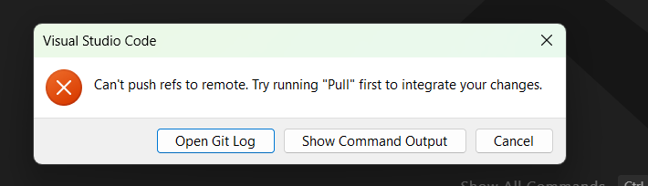
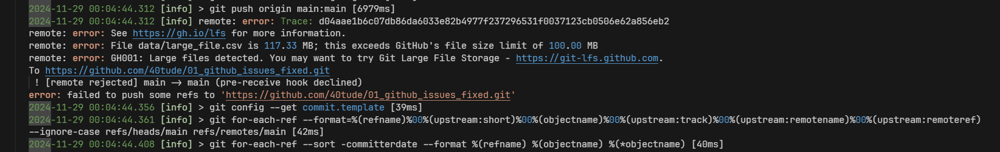
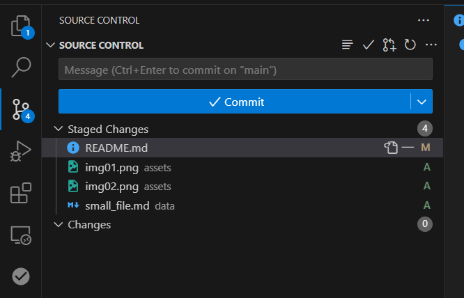

# Intro
Je veux tester au moins 2 cas qui me mettent toujours en panique

# Gros Fichier - Cas 1
J'ai un projet qui est synchronisé sur GitHub  
J'ajoute un fichier > 100 MB  
J'oublie d'en tenir compte dans .gitignore  
Je commit  
Je synchronize  

## PANIQUE! 😡

<p align="center">

<p>


<p align="center">

<p>

Il semble qu'il a rien poussé    
J'édite ``.gitignore``  
Je prends 2 captures d'écran que je met dans un dosier ``./assets``
Je pouse et je synchronise

Même problème


``git reset --soft HEAD~2``

Ca nous ramène à 2 commits en arrière

`git rm --cached .\data\large_file.csv`

Le gros fichier n'est plus suivi


<p align="center">

<p>

Editer ``.gitignore``  


```git
# -----------------------------------------------------------------------------
# files to ignore
secrets.ps1
.env
Jenkinsfile
*.log

# too big
large_file.csv

# -----------------------------------------------------------------------------
# directories to ignore
.git/
.vscode/

# "**/.mypy_cache/" ignore all directories named ".mypy_cache/""
**/.mypy_cache/
**/__pycache__/
**/mlruns/ 
**/logs/
```

Tout sauver  
Fair un ``commit``  
Faire un   

``git push origin main --force``  

* **SYNCHRONIZE** (pull + push) n'est **PAS** suffisant ici 
* car les historiques local et distants ne sont plus synchros

### **Différence entre Synchronize et git push --force**
| **Action**         | **Synchronize**                              | **git push --force**                     |
|---------------------|---------------------------------------------|------------------------------------------|
| **Récupération des modifications distantes** | Fait un `pull` avant le `push`.         | Ne fait aucun `pull`.                    |
| **Gestion des désalignements**    | Échoue si l’historique diverge.         | Écrase l’historique distant.             |
| **Cas d’utilisation** | Cas normaux (pas de désalignement).         | Réécriture d’historique ou conflits majeurs. |

## PLUS de PANIQUE...😁

## Résumé

```powershell
git reset --soft HEAD~2
git rm --cached .\data\large_file.csv
Edite .gitignore
Commit
git push origin main --force
```
Ou alors 

```powershell
git reset --soft HEAD~2
git rm --cached .\data\large_file.csv
git add .gitignore
git commit -m "Remove large file and update .gitignore"
git push origin main --force
```

# Gros Fichier - Cas 2

J'ai un projet qui est synchronisé sur GitHub  
J'ajoute un fichier > 100 MB  
J'oublie d'en tenir compte dans .gitignore  
Je commit  

Je réalise que j'ai un gros fichier...
Comment revenir en arrière ?

## PANIQUE!

```powershell
git reset --soft HEAD~1
git rm --cached .\data\large_file_2.csv
Edit .gitignore
git add .gitignore
git commit -m "Remove large_file_2 and update .gitignore"
git push origin main --force
```
### Note ChatGPT
Les modifications non committées dans ton espace de travail ne seront pas perdues avec un git reset --soft.   
reset --soft : Ce mode préserve toutes tes modifications dans la staging area (index) et l’espace de travail.   
Rien ne sera perdu.  
Si tu veux plus de sécurité, tu peux faire une copie temporaire de ton travail (``git stash``) avant d’exécuter cette commande.

```powershell
git stash                       # Optionnel, si tu veux sauvegarder tes modifications locales
git reset --soft HEAD~1         # Annule le dernier commit
git rm --cached ./data/large_file_2.csv  # Supprime le fichier du suivi Git
echo "/data/large_file_2.csv" >> .gitignore  # Ajoute au .gitignore
git add .gitignore              # Ajoute le fichier .gitignore
git add .                       # Ajoute les autres modifications
git commit -m "Remove large file and update .gitignore"
git push origin main --force    # Réécrit l'historique
git stash pop                   # Optionnel, pour restaurer tes modifications
```

