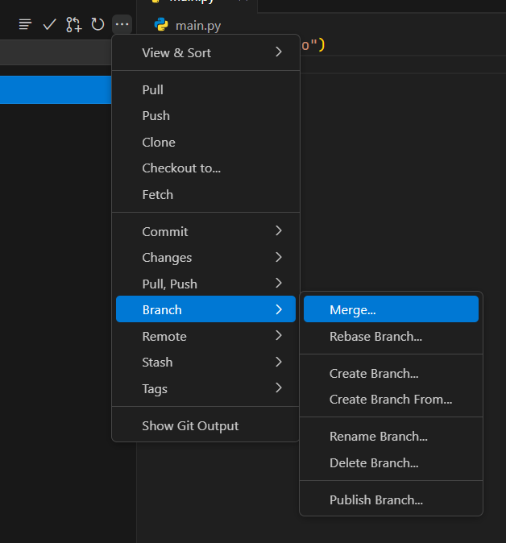
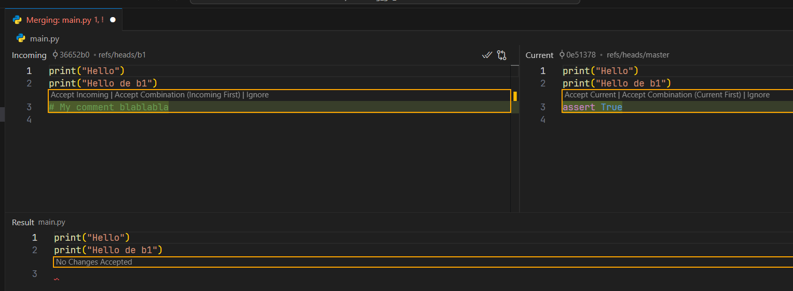
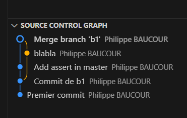

<!-- ####################################################################### -->
<!-- ####################################################################### -->
<!-- ####################################################################### -->
# Intro
Je veux mettre noir sur blanc une fois pour toute deux ou trois trucs qui me mettent toujours en panique   
Je sens que ça va se transformer en ``cheat sheet`` cette histoire...  


<!-- ####################################################################### -->
<!-- ####################################################################### -->
<!-- ####################################################################### -->
# Branch & Merge

Clairement je n'ai pas encore le réflexe...  
Je promets, à partir de demain, je fais un effort de ce côté là  
  
  
  
J'ai un projet avec un repo GitHub  
J'ai une idée transcendantale...  


## Mode VSCode
En bas à gauche je clique sur ``main``  
Je choisis `Create New Branch` (``b1`` par exemple)  
Je modifie, j'ajoute des fichiers, je teste...  
Je commit plusieurs fois
Quand j'ai terminé sur ``b1``


### Je suis pas content
Je reviens sur ``main`` en cliquant en bas à gauche  
Je supprime la branche ``b1``  


### Je suis content  
Je reviens sur ``main`` en cliquant en bas à gauche  
Je choisis Branch/Merge/b1  

<p align="center">

<p>

Quand le merge est fait, je commit `main`  
Je peux supprimer la branche ``b1``  


### Si au moment du merge y a un conflit

<p align="center">

<p>

Ensuite on fait un commit de ``main``
Voir le graphe en bas à gauche

<p align="center">

<p>


## Mode CLI

On peut mélanger Mode VSCode et CLI  


| Action                          | Commande                                   |
|---------------------------------|--------------------------------------------|
| Initialiser un dépôt Git        | `git init`                                 |
| Ajouter des fichiers            | `git add <file>` `git add .`               |
| Faire un commit                 | `git commit -m "message"`                  |
| Créer une branche               | `git checkout -b <branch-name>`            |
| Basculer entre branches         | `git checkout <branch-name>`               |
| Ou créer/basculer sur la branche| `git switch -c <branch-name>`              |
| Fusionner une branche           | `git merge <branch-name>`                  |
| Résoudre un conflit             | Résoudre le conflit, puis `git add <file>` |
| Supprimer une branche           | `git branch -d <branch-name>`              |
| Historique des commits          | `git log --oneline --graph --all`          |


<!-- ####################################################################### -->
<!-- ####################################################################### -->
<!-- ####################################################################### -->
# Gros Fichier - Cas 1

J'ai un projet qui est synchronisé sur GitHub  
J'ajoute un fichier > 100 MB  
J'oublie d'en tenir compte dans ``.gitignore``  
Je commit  
Je synchronise  

## PANIQUE! 😡

<p align="center">

<p>


<p align="center">

<p>

Il semble qu'il n'a rien poussé    
J'édite ``.gitignore``  
Je prends 2 captures d'écran que je met dans un dosier ``./assets``  
Je commit et je synchronise

Même problème


``git reset --soft HEAD~2``

Cela nous ramène à 2 commits en arrière dans le ``staging area``   
* Sous VSCode on le voit dans l'interface graphique

`git rm --cached .\data\large_file.csv`

Le gros fichier n'est plus suivi


<p align="center">

<p>

Editer ``.gitignore``  


```git
# -----------------------------------------------------------------------------
# files to ignore
secrets.ps1
.env
Jenkinsfile
*.log

# too big
large_file.csv

# -----------------------------------------------------------------------------
# directories to ignore
.git/
.vscode/

# "**/.mypy_cache/" ignore all directories named ".mypy_cache/""
**/.mypy_cache/
**/__pycache__/
**/mlruns/ 
**/logs/
```

Tout sauver  
Fair un ``commit``  
Faire un ``git push origin main --force``  

* **SYNCHRONIZE** (pull + push) n'est **PAS** suffisant ici 
* En effet les historiques local et distants ne sont PLUS synchros (=> ``--force``)

### **Différence entre Synchronize et git push --force**

| **Action**                                   | **Synchronize**                    | **git push --force**                        |
|----------------------------------------------|------------------------------------|---------------------------------------------|
| **Récupération des modifications distantes** | Fait un `pull` avant le `push`     | Ne fait aucun `pull`.                       |
| **Gestion des désalignements**               | Échoue si l’historique diverge     | Écrase l’historique distant.                |
| **Cas d’utilisation**                        | Cas normaux (pas de désalignement) | Réécriture d’historique ou conflits majeurs |

## PLUS de PANIQUE...😁

## Résumé

```powershell
git reset --soft HEAD~2
git rm --cached .\data\large_file.csv
Edite le .gitignore
Commit
git push origin main --force
```
Ou alors 

```powershell
git reset --soft HEAD~2
git rm --cached .\data\large_file.csv
git add .gitignore
git commit -m "Remove large file and update .gitignore"
git push origin main --force
```


<!-- ####################################################################### -->
<!-- ####################################################################### -->
<!-- ####################################################################### -->
# Gros Fichier - Cas 2

J'ai un projet qui est synchronisé sur GitHub  
J'ajoute un fichier > 100 MB  
J'oublie d'en tenir compte dans ``.gitignore``  
Je commit **mais** je ne fais **PAS** de synchronisation  

Je réalise que j'ai un gros fichier...
Comment revenir en arrière ?

## PANIQUE! 😡

```powershell
git reset --soft HEAD~1
git rm --cached .\data\large_file_2.csv
Edit .gitignore
git add .gitignore
git commit -m "Remove large_file_2 and update .gitignore"
git push origin main --force
```


### Note de ChatGPT :
Les modifications non committées dans ton espace de travail ne seront pas perdues avec un ``git reset --soft``.   
Ce mode préserve toutes tes modifications dans la staging area (index) et l’espace de travail.   
Si tu veux plus de sécurité, tu peux faire une copie temporaire de ton travail (``git stash``) avant d’exécuter cette commande.

```powershell
git stash                       # Optionnel, si tu veux sauvegarder tes modifications locales
git reset --soft HEAD~1         # Annule le dernier commit
git rm --cached ./data/large_file_2.csv  # Supprime le fichier du suivi Git. On le voit plus das VSCode Source Control
echo "/data/large_file_2.csv" >> .gitignore  # Ajoute au .gitignore
git add .gitignore              # Ajoute le fichier .gitignore
git add .                       # Ajoute les autres modifications
git commit -m "Remove large file and update .gitignore"
git push origin main --force    # Réécrit l'historique
git stash pop                   # Optionnel, pour restaurer tes modifications
```
On retrouve bien le projet synchro sur GitHub

## PLUS de PANIQUE...😁

## Résumé

```powershell
git stash                       
git reset --soft HEAD~1         
git rm --cached ./data/large_file_2.csv  
echo "/data/large_file_2.csv" >> .gitignore  
git add .gitignore              
git add .                       
git commit -m "Remove large file and update .gitignore"
git push origin main --force    
git stash pop                   
```


<!-- ####################################################################### -->
<!-- ####################################################################### -->
<!-- ####################################################################### -->
# Fichier `secrets.ps1` 

J'ai un projet qui est synchronisé sur GitHub  
J'ajoute un fichier `secrets.ps1`  
J'oublie d'en tenir compte dans ``.gitignore``  
Je commit  et je sync

Comment revenir en arrière ?

## PANIQUE! 😡

```powershell
git reset --soft HEAD~1         
git rm --cached ./secrets.ps1   
Edition de .gitignore   
git add .gitignore              
git add .                       
git commit -m "Remove secrets.ps1 to avoid a nuclear war :-)" 
git push origin main --force    
```

### Pour aller plus loin il faut : 
* Nettoyer tout l’historique public : ``filter-repo``
* Supprimer le cache GitHub pour garantir qu’aucune trace ne reste sur leurs serveurs 

### filter-repo :
```powershell 
# Voir si on veut créer un env virtuel ou pas ????
# conda install filter-repo -c conda-forge 
#       marche pas trop
#       trouve rien 
#       en plus c'est pas à jour

pip install git-filter-repo
git config --global filter.repo.clean "git filter-repo"
```

Ensuite faut faire   

```powershell 
cd chemin/vers/le/depot
git filter-repo --invert-paths --path ./secrets.ps1
git push origin main --force
```

### Vider caches du repos sur GitHub :
* GitHub/Settings/Actions/Cache/supprime les caches liés au projet
<!-- 
https://github.com/40tude/01_github_issues_fixed/actions/caches
-->

## PLUS de PANIQUE...😁


<!-- ####################################################################### -->
<!-- ####################################################################### -->
<!-- ####################################################################### -->
# Répertoire de logs
J'ai un projet qui est synchronisé sur GitHub  
J'ajoute un répertoire ``./log`` avec des centaines de logs qu'il est ridicule d'avoir sur GitHub.   
J'oublie d'en tenir compte dans ``.gitignore``  
J'ai fait un commit et une synchro    
Les fichiers de logs sont petits, tout est parti sur GitHub

Mais comment faire ? Comment revenir en arrière ?

## PANIQUE! 😡


Je propose

```powershell
git reset --soft HEAD~1         
git rm -r --cached ./logs   
Edition de .gitignore (/logs/)   
git add .gitignore              
git add .                       
git commit -m "Remove ./logs and all the logs files" 
git push origin main --force    
```

Bien voir le ``-r`` de la commande ``git rm``

## PLUS de PANIQUE...😁


<!-- ####################################################################### -->
<!-- ####################################################################### -->
<!-- ####################################################################### -->
# Pull Request

Aller sur : `https://github.com/firstcontributions/first-contributions`  
Forker le projet  
Cloner le projet : ``git clone https://github.com/40tude/first-contributions.git``  
Lire : `https://github.com/firstcontributions/first-contributions/blob/main/gui-tool-tutorials/github-windows-vs-code-tutorial.md`  
Créer une branche ``b1``  
Faire des modifs  
Sauver  
Faire un commit de la branche `b1` sur le fork de notre repo  
GitHub détecte une différence entre le fork et le projet original  
Il propose de faire un pull request  
Quand c'est fait, la PR est alors une proposition de merge de la branche `b1` du fork vers la branche `main` du projet original  
Ensuite...  
Les mainteneurs examinent la PR.  
Il l'accepetent ou demandent des changements (via des commentaires sur GitHub).  
On fait les changements directement dans la branche `b1` sur le host puis on commit sur notre fork   
Les modifs seront automatiquement ajoutées à ta PR
Ensuite quen la PR a été acceptée et fusionnée il faut :
`git remote add upstream <URL-du-projet-original>` (à faire une seule fois)  
``git switch main``  
``git fetch upstream``  
``git merge upstream/main``  

Supprimer la branche ``b1``  


## Que faire si la branche b1 est affectée par ces changements ?

``git switch b1``

Rebaser b1 sur la branche main à jour pour appliquer les changements récents de ``main`` sur la branche ``b1`` 
Cela ajuste l’historique de la branche ``b1`` pour qu’elle repose sur la dernière version de main.

``git rebase main``

Si il y a des conflits, les résoudre
À la fin

``git rebase --continue``


Après le rebase, faut forcer le push de la branche ``b1`` vers le fork (car l’historique a changé)
``git push origin b1 --force``

### Note pour savoir si il faut faire un rebase de ``b1``

| Action                                              | Commande                |
|-----------------------------------------------------|-------------------------|
| Vérifier si ``b1`` est en retard par rapport à main | `git log b1..main`      |
| Identifier les fichiers impactés                    | ``git diff b1..main``   |
| Faire un commit                                     | ``git rebase main``     |

Etape 2 : on va voir les fichiers qui ont changé dans ``main`` mais pas dans ``b1``.  
Si on voit fichiers sur lesquels on travaille dans b1, alors il est conseillé de rebaser  


## Le lendemain matin
```powershell
# Ajouter le projet original comme remote (une seule fois)
git remote add upstream <URL-du-projet-original>

# Récupérer les mises à jour du projet original et les mettre dans un arbre qui s'appelle upstream
git fetch upstream

# Mettre à jour la branche main locale en applicant les modifications qui sont dans la branche upstream/main
git switch main
git merge upstream/main

# Pousser les mises à jour sur mon fork sur GitHub
git push origin main
```


